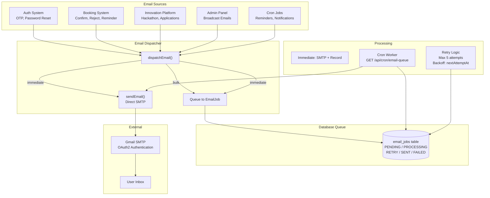

# Email System

## Overview

The Email System handles all outgoing emails from the CoE Portal. It uses a **queue-based architecture** with **database persistence** for reliable delivery.

## Why This Module Exists

The portal needs to send many types of emails: OTP codes, booking confirmations, hackathon results, application decisions, broadcast announcements. Each email must be:

- **Reliable** — Survives server restarts
- **Trackable** — Know if it was sent, failed, or pending
- **Retryable** — Failed emails should be retried
- **Prioritizable** — Some emails are urgent (OTP), others can wait (bulk announcements)

A simple `sendEmail()` call that directly connects to SMTP can fail (network blip, SMTP timeout). The queue architecture ensures no email is lost.

## Real-World Analogy

Think of a restaurant kitchen:

- **Customer order** = Request to send an email
- **Kitchen ticket** = `EmailJob` database record
- **Chef** = The SMTP transporter (actually sends the email)
- **Expediter** = The cron worker that processes pending tickets
- **Urgent orders** = `immediate` mode (rush to the front of the line)
- **Regular orders** = `bulk` mode (processed in batches)

## Architecture



## Queue Architecture

### The EmailJob Model

**File: `prisma/schema.prisma` (line 804)**

```prisma
model EmailJob {
  id                Int       @id @default(autoincrement())
  toEmail           String
  subject           String
  htmlBody          String    @db.LongText       // Full HTML content
  category          String                        // "BOOKING_CONFIRMED", "OTP", etc.
  mode              String    @default("IMMEDIATE")  // IMMEDIATE or BULK
  status            String    @default("PENDING")    // PENDING, PROCESSING, RETRY, SENT, FAILED
  priority          Int       @default(50)
  attempts          Int       @default(0)
  maxAttempts       Int       @default(5)
  nextAttemptAt     DateTime?
  lastAttemptAt     DateTime?
  sentAt            DateTime?
  lockedAt          DateTime?
  lastError         String?   @db.Text
  providerMessageId String?
  dedupeKey         String?   @unique
  metadata          Json?
  createdAt         DateTime  @default(now())
  updatedAt         DateTime  @updatedAt

  @@index([status, nextAttemptAt])
  @@index([category])
}
```

### Two Delivery Modes

| Mode | Behavior | Use Cases |
|------|----------|-----------|
| **`immediate`** | SMTP send FIRST, then record job as SENT/FAILED | OTP, booking confirmations, password reset |
| **`bulk`** | Queue as PENDING, cron worker processes later | Broadcast announcements, notifications |

### The dispatchEmail Function

**File: `src/lib/email-delivery.ts`**

```typescript
export async function dispatchEmail(input: DispatchEmailInput) {
  const { to, subject, html, category, mode = 'immediate', dedupeKey, metadata } = input;

  if (mode === 'immediate') {
    // 1. Try to send via SMTP
    // 2. Record result as SENT or FAILED
    // 3. If SMTP fails, still record with status FAILED
    //    (so admin can retry later)
  } else {
    // 1. Create EmailJob record with status PENDING
    // 2. Cron worker will process it
  }
}
```

### The SMTP Transporter

**File: `src/lib/email-delivery.ts`**

Uses Gmail's SMTP with OAuth2 authentication:

```typescript
const transporterOptions = {
  host: 'smtp.gmail.com',
  port: 465,
  secure: true,
  auth: {
    type: 'OAuth2',
    user: process.env.SMTP_USER,
    clientId: process.env.GOOGLE_CLIENT_ID,
    clientSecret: process.env.GOOGLE_CLIENT_SECRET,
    refreshToken: process.env.GOOGLE_REFRESH_TOKEN,
  },
};
```

The transporter is **cached globally** (singleton pattern) so OAuth2 token refresh happens automatically.

## Email Templates

**File: `src/lib/mailer.ts`** (782 lines)

All emails use a common HTML wrapper:

```typescript
const wrap = (body: string) => `
<!DOCTYPE html>
<html>
<body style="margin:0;padding:0;background:#faf9f5;">
  <div style="max-width:600px;margin:24px auto;border:1px solid #c4c6d3;">
    <div style="background:#002155;padding:16px 24px;text-align:center;">
      <h1 style="color:#ffffff;font-size:20px;">TCET CENTRE OF EXCELLENCE</h1>
      <div style="height:4px;background:#F7941D;"></div>
    </div>
    <div style="padding:24px;background:#ffffff;">${body}</div>
    <div style="background:#f5f4f0;padding:16px 24px;text-align:center;font-size:11px;color:#747782;">
      Thakur College of Engineering & Technology, Kandivali (E), Mumbai - 400101
    </div>
  </div>
</body></html>`;
```

### All Email Template Functions

| Function | Category | Trigger |
|----------|----------|---------|
| `sendOTPEmail(email, otp)` | OTP | Registration OTP |
| `sendPasswordResetOTPEmail(email, otp)` | PASSWORD_RESET | Forgot password |
| `sendBookingConfirmationEmail(email, details)` | BOOKING_CONFIRMED | Booking confirmed |
| `sendBookingRejectionEmail(email, details, reason)` | BOOKING_REJECTED | Booking rejected |
| `sendBookingReminderEmail(email, details)` | BOOKING_REMINDER | 30-min reminder |
| `sendFacultyPendingNotification(adminEmail, details)` | FACULTY_PENDING | Faculty registered |
| `sendTicketIssuedEmail(email, details)` | TICKET_ISSUED | Ticket generated |
| `sendHackathonResultEmail(email, details)` | HACKATHON_RESULT | Hackathon closed |
| `sendApplicationDecisionEmail(email, details)` | APPLICATION_DECISION | Application reviewed |
| `sendTeamTicketEmail(leaderEmail, details)` | TEAM_TICKET | Team shortlisted |

## Cron Worker

**File: `src/app/api/cron/email-queue/route.ts`**

```typescript
export async function GET(req: NextRequest) {
  // Protected by CRON_SECRET

  // 1. Claim pending jobs (mark as PROCESSING)
  const jobs = await prisma.emailJob.findMany({
    where: {
      OR: [
        { status: 'PENDING', nextAttemptAt: null },
        { status: 'RETRY', nextAttemptAt: { lte: new Date() } },
      ],
      AND: [
        { OR: [{ lockedAt: null }, { lockedAt: { lt: fiveMinAgo } }] },
      ],
    },
    orderBy: { priority: 'desc' },
    take: 50,
  });

  // 2. Send each via SMTP
  for (const job of jobs) {
    try {
      await sendEmail({ to: job.toEmail, subject: job.subject, html: job.htmlBody });
      await prisma.emailJob.update({
        where: { id: job.id },
        data: { status: 'SENT', sentAt: new Date(), attempts: job.attempts + 1 },
      });
    } catch (err) {
      if (job.attempts >= job.maxAttempts) {
        await prisma.emailJob.update({
          where: { id: job.id },
          data: { status: 'FAILED', lastError: String(err) },
        });
      } else {
        await prisma.emailJob.update({
          where: { id: job.id },
          data: {
            status: 'RETRY',
            attempts: job.attempts + 1,
            lastError: String(err),
            nextAttemptAt: calculateNextRetry(job.attempts + 1),
          },
        });
      }
    }
  }

  // 3. Release locks
}
```

## Admin Email Broadcast

Admins can send broadcast emails through the admin panel:

- **Endpoint**: `POST /api/admin/emails/send`
- **Options**: Send to specific users, all students, all faculty, or all users
- **Mode**: Bulk (queued for cron processing)
- **Attachments**: Optional file uploads
- **Retry**: Manual retry via `POST /api/admin/emails/retry`

## Email Categories (for filtering/admin)

```
OTP, PASSWORD_RESET, BOOKING_CONFIRMED, BOOKING_REJECTED,
BOOKING_REMINDER, BOOKING_TICKET_ISSUED, ADMIN_BOOKING_REQUEST,
FACULTY_PENDING, HACKATHON_RESULT, HACKATHON_ACTIVE,
HACKATHON_SCREENING, HACKATHON_JUDGING, APPLICATION_DECISION,
TICKET_ISSUED, TEAM_TICKET, BROADCAST
```

## Common Bugs

### 1. OAuth2 Token Expiry

**Problem**: Gmail OAuth2 access tokens expire after 1 hour. If the refresh token works, Nodemailer handles this automatically. But if `GOOGLE_REFRESH_TOKEN` is missing or invalid, ALL emails fail.

**Fix**: The transporter is created once and cached. If the refresh token is expired, regenerate it from Google Cloud Console.

### 2. Bulk Mode Emails Never Sent

**Problem**: Email is queued with status `PENDING` but never processed because the cron worker isn't triggered.

**Fix**: The cron endpoint `GET /api/cron/email-queue` must be called by an external scheduler (e.g., cron-job.org, a VPS cron tab) every 1-5 minutes.

### 3. Dedupe Key Collisions

**Problem**: Two identical email jobs with the same `dedupeKey` — the second one fails due to unique constraint.

**Fix**: The `dedupeKey` field has `@unique`. Use a meaningful key like `booking-confirm-${bookingId}` to prevent duplicates.

## Debugging Guide

1. **Check email_jobs table**: `SELECT * FROM email_jobs WHERE status = 'FAILED'`
2. **Check SMTP logs**: The `lastError` field contains the SMTP error message
3. **Manually retry**: Use `POST /api/admin/emails/retry` or update status back to `PENDING`
4. **Test SMTP**: Temporarily set `mode: 'immediate'` to see errors immediately
5. **Check env vars**: Ensure all SMTP OAuth2 variables are set

## Exercises

1. **Create a new email template**: Add a function in `mailer.ts` and call it from a route
2. **Add a new email category**: Add to the category string and use it in `dispatchEmail()`
3. **Change retry limits**: Modify `maxAttempts` in `dispatchEmail()`
4. **Broadcast to a custom group**: Extend the admin email endpoint

## Summary

The email system uses a database-backed queue for reliable delivery with two modes: immediate (SMTP first, then record) and bulk (queue then process via cron). The OAuth2 SMTP connection to Gmail is cached globally. Failed emails are retried up to 5 times. The admin panel provides broadcast capabilities and manual retry.
