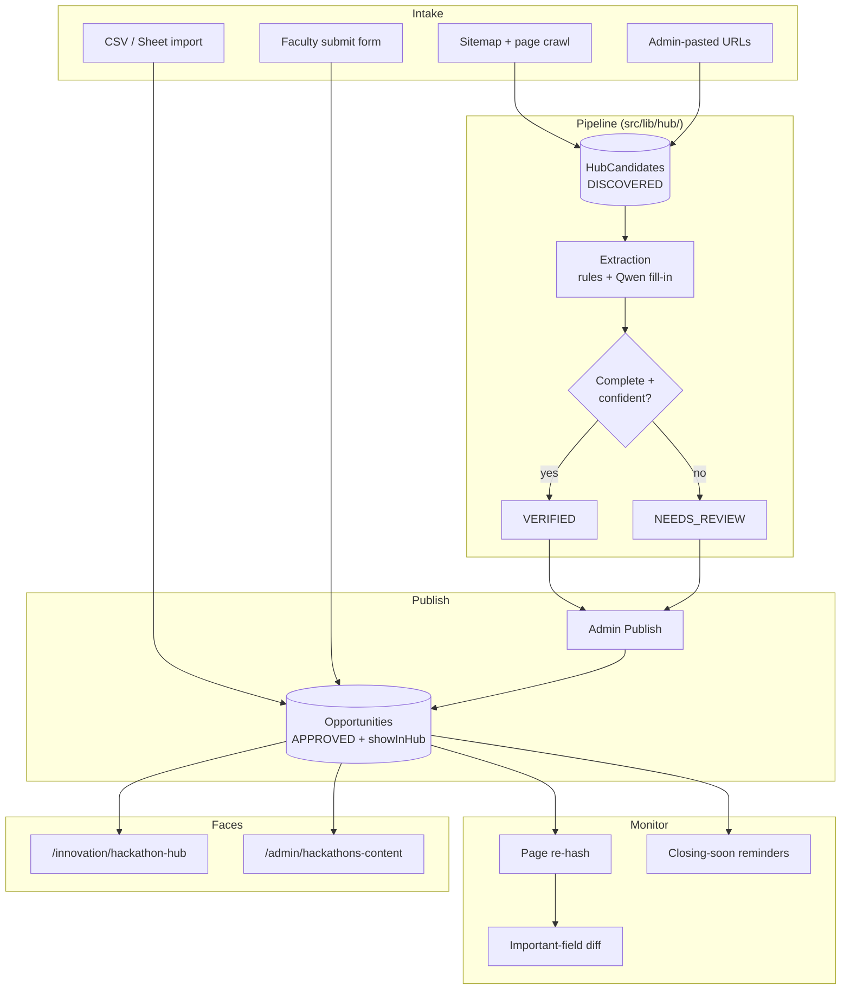
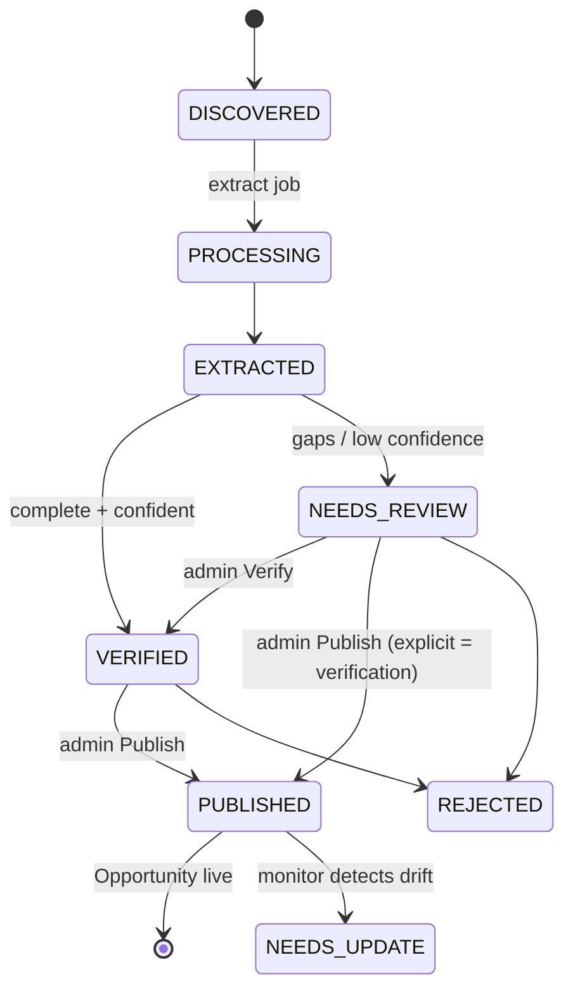

# Hackathon Hub

External hackathon discovery, verification, publishing, and student-facing browsing for the TCET CoE Portal. One-line idea: **a 10-column student viewer backed by a 40-field automated data pipeline** — discover → extract → validate → deduplicate → verify → publish → monitor → update.

## Contents

1. [Overview](#1-overview)
2. [Architecture](#2-architecture)
3. [Data model](#3-data-model)
4. [Pipeline stages](#4-pipeline-stages)
5. [Student interface](#5-student-interface)
6. [Admin interface](#6-admin-interface)
7. [CSV / Google Sheet import](#7-csv--google-sheet-import)
8. [API reference](#8-api-reference)
9. [Automation and scheduling](#9-automation-and-scheduling)
10. [Email notifications](#10-email-notifications)
11. [Verification, confidence, and data-quality rules](#11-verification-confidence-and-data-quality-rules)
12. [Deployment checklist](#12-deployment-checklist)
13. [Troubleshooting](#13-troubleshooting)
14. [File index](#14-file-index)

---

## 1. Overview

Students previously had no single place to find outside hackathons, and faculty re-typed event details from one platform to another. The Hub fixes both sides:

- **Students** browse verified hackathons at `/innovation/hackathon-hub` with search, grouped filters, auto-calculated statuses, distance from TCET, detail views, and bookmarks.
- **Admins** curate from `/admin/hackathons-content`: a review queue fed by automated discovery, one-click Verify/Publish, CSV/Sheet bulk import, and source toggles. Target workflow: open queue → review → publish → exit.
- **Automation** (`/api/cron/hub` + GitHub Actions schedule) crawls sources, extracts structured data, re-checks published pages for changes, and reminds students of closing deadlines.

Design decision worth knowing: the Hub **reuses the `Opportunity` system** instead of a parallel table. Every Hub card is an `Opportunity` row; the Hub is its hackathon subset, gated by `showInHub`. This reuses moderation, bookmarks, validators, and admin UI instead of duplicating them. New tables (`HubSource`, `HubCandidate`, `HubImportLog`) hold only pipeline state.

---

## 2. Architecture

Tech mapping of the original PHP-oriented proposal onto this stack: PHP cron files → one guarded Next.js cron route with `?job=` stages; Google Sheets API → CSV text or Sheet CSV-export URL (no OAuth needed); `hackathons` table → extended `Opportunity` model; PHP REST → Next.js route handlers.

---

## 3. Data model

### 3.1 `Opportunity` (extended)

Existing catalog row. Hub-relevant additions (all nullable/additive, zero-backfill migrations):

| Field | Type | Meaning |
|---|---|---|
| `mode` | `ONLINE \| OFFLINE \| HYBRID \| null` | Event format |
| `venue`, `city`, `state` | `String?` | Where |
| `startDate`, `endDate` | `DateTime?` | When |
| `teamMin`, `teamMax` | `Int?` (1–20) | Team size range |
| `sourceUrl` | `Text?` | Page the data came from |
| `sourceType` | `String` (default `ADMIN`) | `OFFICIAL_WEBSITE`, `DEVFOLIO`, `UNSTOP`, `HACKEREARTH`, `HACK2SKILL`, `MLH`, `INDIAHACKATHONS`, `COLLEGE_WEBSITE`, `GOVERNMENT`, `SOCIAL_MEDIA`, `ADMIN`, `GOOGLE_SHEET`, `OTHER` |
| `verificationStatus` | `String` (default `UNVERIFIED`) | `UNVERIFIED`, `PLATFORM_VERIFIED`, `OFFICIAL_SOURCE`, `ADMIN_VERIFIED`, `VERIFIED`, `NEEDS_UPDATE` |
| `lastVerifiedAt` | `DateTime?` | Last human/machine check |
| `pageHash` | `String?` | SHA-256 of normalized source page (change detection) |
| `showInHub` | `Boolean` (default `false`) | **Subset boundary** — only `APPROVED + showInHub` rows appear in the Hub |

Indexes: `status`, `category`, `registrationDeadline`, `mode`, `city`, `verificationStatus`, `startDate`, `showInHub`.

### 3.2 `HubSource` — source registry

One row per discovery source; jobs never hard-code sources. Fields: `key` (unique), `label`, `method` (`PAGE`/`RSS`/`API`/`MANUAL`), `frequency` (`DAILY`/`WEEKLY`), `priority` (higher wins conflicts), `enabled`, `lastRunAt`, `lastError`. Defaults are seeded by `ensureHubSources()` (11 sources; JS app-shell crawlers sit at `MANUAL` so they accept pasted URLs without wasting fetches).

### 3.3 `HubCandidate` — candidate store

A discovered URL before it becomes public. `status` lifecycle:

Fields: `url` (unique), `source`, `sourceType`, `title`, `extracted` (JSON), `confidence` (float), `pageHash`, `error`, `opportunityId` (set on publish).

### 3.4 `HubImportLog`

Append-only run log: `source` (`CSV`/`SHEET_URL`/`DISCOVERY`), `discovered`, `inserted`, `updated`, `rejected`, `published`, `errors` (first 50).

---

## 4. Pipeline stages

All in `src/lib/hub/`, triggered by `/api/cron/hub?job=` (see §9).

### 4.1 Discovery (`discovery.ts`)

1. **Sitemap-first** (`discoverFromSitemap`): one fetch of `indiahackathons.com/sitemap.xml` yields every `/events/` URL (complete coverage, no HTML parsing).
2. **Page crawl** for enabled `PAGE` sources: polite fetch (15s timeout, 1.5s gap, `TCET-CoE-HubBot/1.0` user-agent), extract links whose titles match hackathon keywords, skip nav noise, listing-page titles ("Explore hackathons"), self-links, and form paths (`/submit`, `/login`…).
3. **Dedupe** by exact URL; each new candidate stores the source page's SHA-256 as its baseline `pageHash`; per-source errors recorded on the source row, never aborting other sources.

### 4.1a Search query strategy (§10) and geo tiers (§11)

Kept here as the living spec; they become code only if a search-provider key is configured.

- **Location:** hackathon Mumbai / Navi Mumbai / Thane / Pune / Maharashtra / India 2026, online hackathon 2026
- **Institution:** college / engineering-college-Maharashtra / university hackathon Mumbai 2026
- **Technology:** AI, ML, GenAI, cybersecurity, cloud, IoT, blockchain hackathon 2026 India
- **Platform:** `site:devfolio.co`, `site:unstop.com`, `site:hackerearth.com`, `site:hack2skill.com`, `site:mlh.io` scoped queries
- **Tiers:** local (TCET vicinity, Mumbai, Navi Mumbai, Thane) → Maharashtra (Pune, Nagpur, Nashik, Chhatrapati Sambhajinagar, Kolhapur) → national (India-wide, online, international-online open to Indian students)

### 4.2 Extraction (`extract.ts`)

Three layers, in order — missing stays `NULL`, never invented:

1. **JSON-LD first**: `extractJsonLdEvent()` parses schema.org `Event` blocks (name, dates, organizer, city/state, attendance mode → `ONLINE`/`OFFLINE`/`HYBRID`, offer URL). Proven on indiahackathons event pages.
2. **Rule heuristics**: `<title>`/og:title/h1, "organized by" patterns, date regexes (event-start phrasing preferred over publish dates), city near location keywords (Online events get no city — footer noise), prize only with a real amount, team ranges (inverted ranges nulled), eligibility only with a structured label.
3. **Qwen fill-in** (`aiFill`): when `QWEN_API_KEY` is set, the model receives page text and fills *only* the still-missing mandatory fields, `null` when absent. Without a key the pipeline is rules-only.

**Confidence** (`scoreConfidence`): base 0.4 + 0.05 per mandatory field + source bonus (official/admin +0.2, platforms +0.1) + small extras, capped 0.95. ≥0.90 with all mandatory fields → `VERIFIED`, else `NEEDS_REVIEW` listing what's missing.

### 4.3 Publish (`pipeline.ts`)

Admin-only, explicit. Merges by registration/source URL, else normalized name + organizer. Missing fields become `NULL` (plus a visible "auto-published with missing fields" note); text clipped to column limits (`clipDbString`/`fitUrl` — the single DB-boundary guard against MySQL `P2000` errors); sets `APPROVED + ADMIN_VERIFIED + showInHub + pageHash`.

### 4.4 Monitor (`monitor.ts`)

- **Change detection**: re-fetch each published source page, SHA-256 the normalized content; on drift, re-extract and diff important fields (deadline, prize, eligibility, team, venue, dates) → `NEEDS_UPDATE` + admin email. HTTP 404 → review + email; 403/empty → skipped silently.
- **Closing-soon**: deadlines within 48h → bulk reminder emails to students who saved the event (deduped per day), then drains 50 queued emails.

---

## 5. Student interface

Route: `/innovation/hackathon-hub` (linked left of Innovation Home as a gold **Hackathon Hub** button).

- **Search** (name/organizer/keyword) on its own full-width line.
- **Grouped filters** with plain labels: Where (city) · How (mode) · Status (registration) · When (month) · What (domain/tech) · Order (newest/deadline) · footer count + **Clear all**. (The old quick-chip row was removed as redundant.)
- **Cards** (8 fields): status badge, event badge, verification badge, title, organizer, date, location (+ mode + `X km from TCET`), team, domain, prize, deadline. Register / View Details / Bookmark.
- **Honest unknown handling**: the DB keeps `NULL`, but cards never show a confusing `UNKNOWN` badge — status falls back to the start date and is marked `*` ("deadline not published, derived from start date", tooltip + footer legend); deadline line reads "Not published — starts …".
- **Details modal**: Overview, Registration, Eligibility, Competition, Benefits, Verification (last-verified + source link).

---

## 6. Admin interface

Route: `/admin/hackathons-content` — reachable via Navbar → Portals → **Hackathons Content** (admin-only), a shortcut card on the Admin Panel → Content tab, and back-links in its own header. Sections:

1. **Hub Dashboard** — Total / Active / Closing Soon / Needs Review / Expired / New This Week + **Run pipeline now** (runs `?job=all` with your session; result summary inline). Notes the automated schedule.
2. **Hub Review Queue** — status filter (default **Actionable** = needs-review + verified + needs-update; verified rows stay until published), per-row Verify / Publish / Reject, confidence + missing-field notes inline.
3. **Hub Import — Sheet/CSV** — CSV textarea or Sheet CSV-export URL; result counts + first error.
4. **Hub Sources** — enable/disable toggles, method/frequency/priority display, per-source `lastError`.
5. Existing **External Opportunities moderation** (approve/reject/delete) now with an **In Hub ✓ / Hub?** toggle + badge per row.

---

## 7. CSV / Google Sheet import

No Google OAuth needed: maintain a Sheet, use File → Share → **Publish to web (CSV)**, paste the export URL — or paste CSV text directly. One row = one hackathon; the parser handles quoted commas and newlines.

**Compulsory per row:** `title` (≥2 chars), `organizer` (≥2 — accepts `organizer`, `organiser`, or `owner` headers). `category` defaults to `Hackathon`.

**Optional (blank → NULL):** `description`, `eligibility`, `prize`, `applicationUrl`, `registrationDeadline`, `themes`/`domains`, `technologies`, `mode` (`ONLINE`/`OFFLINE`/`HYBRID`), `venue`, `city`, `state`, `startDate`, `endDate`, `teamMin`/`teamMax` (1–20), `sourceUrl`, `sourceType`. Header names are forgiving (`eventName`/`title`/`name`, `organiser`, `deadline`, `registrationUrl`/`applyLink`, `officialUrl`, `prizePool`, `domains`, `eventType`… — full map in `src/lib/hub/csv.ts`).

**Semantics:** admin imports publish immediately (`APPROVED + ADMIN_VERIFIED + showInHub`); faculty imports land `PENDING`. Dedupe by source URL, then normalized name + organizer. **Conflict guard:** rows colliding with `VERIFIED`/`ADMIN_VERIFIED`/`OFFICIAL_SOURCE` records are rejected with a message, never overwritten. Every run writes a `HubImportLog`.

---

## 8. API reference

Public:

| Endpoint | Purpose |
|---|---|
| `GET /api/hackathon-hub?search=&city=&mode=&domain=&month=YYYY-MM&regStatus=&eventStatus=&sort=` | Student listing (`APPROVED + showInHub`), derived `regStatus`/`eventStatus`, `regStatusSource`, `distanceKm`/`distanceLabel`, `myInterest` |

Admin (all `ADMIN`, 401/403 otherwise):

| Endpoint | Purpose |
|---|---|
| `GET /api/admin/hub/stats` | Dashboard rollup |
| `GET /api/admin/hub/candidates?status=a,b` | Review queue (comma list; omit = all) |
| `POST /api/admin/hub/candidates` `{url, source?, sourceType?, title?}` | Track a URL manually |
| `PATCH /api/admin/hub/candidates/[id]` `{action: verify\|reject\|publish}` | Verify / reject / publish-and-promote |
| `POST /api/admin/hub/import` `{csvText? , sheetUrl?}` | Bulk import |
| `GET /api/admin/hub/import` | Recent import logs |
| `GET /api/admin/hub/sources` · `PATCH … {key, enabled?, priority?}` | Registry management |
| `PATCH /api/admin/opportunities/[id]` (+`showInHub`) | Edit / toggle Hub visibility |

Automation (`CRON_SECRET` header/query **or** admin session):

| Endpoint | Purpose |
|---|---|
| `GET /api/cron/hub?job=discover\|extract\|monitor\|closing-soon\|all` | Pipeline stages (10-min/1-h repeat guards) |

---

## 9. Automation and scheduling

- **Code:** stages live in `src/lib/hub/`; the only entrypoint is `/api/cron/hub` (`src/app/api/cron/hub/route.ts`), following the repo's cron conventions (see `docs/handoff/CRON_JOBS.md`).
- **Schedule** (`.github/workflows/hub-pipeline.yml`, self-hosted, `CRON_SECRET` secret, mirroring `monthly-grants.yml`): full `?job=all` daily 02:00 IST (`30 20 * * *` UTC); `?job=closing-soon` at the other three 6-hour slots; manual `workflow_dispatch` with job picker.
- **Manual:** the dashboard's **Run pipeline now** button (admin session, no secret needed).

---

## 10. Email notifications

Via the existing queue (`dispatchEmail` → drained 50 at a time by each cron run). New senders in `src/lib/mailer.ts`:

- `sendHubAdminAlert` (`HUB_ADMIN`, immediate): change detected, broken link, source conflict — links back to the admin panel, sent to `ADMIN_EMAIL`.
- `sendHubClosingSoonReminder` (`HUB_CLOSING_SOON`, bulk, per-day dedupe keys): deadline ≤48h to students who saved the event.

Note: SMTP OAuth vars must exist wherever mail should actually deliver; without them jobs queue (and retry) but nothing sends — check `/api/admin/emails`.

---

## 11. Verification, confidence, and data-quality rules

- **No guessing:** missing is `NULL` in the DB; derived display values are labeled (`*`, tooltips, "Not published").
- **Every published event has a source URL** (candidate URL carried through publish).
- **Important-field changes require review** (`NEEDS_UPDATE`, never silent).
- **Broken links trigger review** (404 → review + email).
- **Duplicates merge** (URL first, normalized name + organizer second; exact-match only — yearly editions never auto-fuse).
- **Publish is always explicit** (admin click or admin import); the pipeline never auto-publishes.
- **Column safety:** all writers clip to `VARCHAR(191)` (`clipDbString`/`fitUrl`); forms validate the same limits for clear 400s instead of `P2000` 500s.

---

## 12. Deployment checklist

- [ ] Merge the Hub branch; deploy auto-runs `migrate deploy` — migrations are additive/nullable (`showInHub` backfills already-approved hackathon-like rows visible).
- [ ] Env: `CRON_SECRET` (app + Actions secret), `ADMIN_EMAIL`, SMTP OAuth (`SMTP_USER`, `GOOGLE_CLIENT_ID/SECRET/REFRESH_TOKEN`), `FRONTEND_URL` (else email links say localhost), optional `QWEN_API_KEY` (rules-only extraction without it).
- [ ] Enable the `hub-pipeline.yml` schedule (runs on the self-hosted runner like grants).
- [ ] Seed content: publish the review queue + import a starter CSV so the Hub isn't empty.
- [ ] Spot-check as student: only `APPROVED + showInHub` rows visible; admin-only routes 403 otherwise.

**Known limits (by design, §42):** JS-rendered platform crawlers are parked at `MANUAL` (page fetches return app shells); auto-discovery's reliable legs are the indiahackathons sitemap + pasted URLs + CSV. Prize pools and registration deadlines are rarely published anywhere — rows surface in `NEEDS_REVIEW` missing only the deadline. No search-API provider, personalization, maps, or chatbot.

---

## 13. Troubleshooting

| Symptom | Cause → fix |
|---|---|
| Queue empty but rows exist | Queue filter is status-scoped — set **Show** to Actionable/All. (This exact bug shipped once: the filter was hardcoded to `NEEDS_REVIEW`.) |
| `/api/admin/hub/*` → 404 in dev | New route files not registered — full dev-server restart + hard refresh. |
| Publish fails | Only title is required; other gaps publish as NULL. `DISCOVERED` rows must be extracted first. |
| `P2000 value too long` | Writer bypassing `clipDbString` — all Hub writers clip; check custom callers. |
| Cron 403 | Wrong/missing secret (header `x-cron-secret` or `?secret=`); admin session also works on `/api/cron/hub`. |
| Build fails in `.next/dev/types/*.d.ts` with truncated code | Corrupt typegen artifact, not our code — delete `.next/dev/types` and rebuild. |
| Prisma `EPERM` on generate (Windows) | A running `next dev` holds the engine DLL — types still update; regenerate after stopping dev. |
| Stale admin clicks, no console errors | Stale mixed build (AGENTS.md Gotcha #4): kill by port PID, relaunch. |

---

## 14. File index

| Area | Files |
|---|---|
| Pipeline lib | `src/lib/hub/sources.ts`, `discovery.ts`, `extract.ts`, `csv.ts`, `pipeline.ts`, `monitor.ts` |
| Shared helpers | `src/lib/hackathon-hub.ts` (statuses, `isHubCategory`, `clipDbString`, `fitUrl`, source/verification enums) |
| Student UI | `src/app/innovation/hackathon-hub/page.tsx`, `src/app/api/hackathon-hub/route.ts` |
| Admin UI | `src/app/admin/hackathons-content/page.tsx` (Dashboard, Queue, Import, Sources) |
| Admin APIs | `src/app/api/admin/hub/{import,candidates,candidates/[id],sources,stats}/route.ts`, `src/app/api/admin/opportunities/[id]/route.ts` (+`showInHub`) |
| Cron + schedule | `src/app/api/cron/hub/route.ts`, `.github/workflows/hub-pipeline.yml` |
| Mail | `sendHubAdminAlert`, `sendHubClosingSoonReminder` in `src/lib/mailer.ts` |
| Schema | `Opportunity` (+12 Hub columns), `HubSource`, `HubCandidate`, `HubImportLog` in `prisma/schema.prisma` |
| Nav | Hub button in `src/app/innovation/page.tsx`; `Hackathons Content` in `src/components/Navbar.tsx` + Admin Content tab |
| Validators | Hub enums, dates, teams, 191-char caps in `src/lib/validators.ts` |
