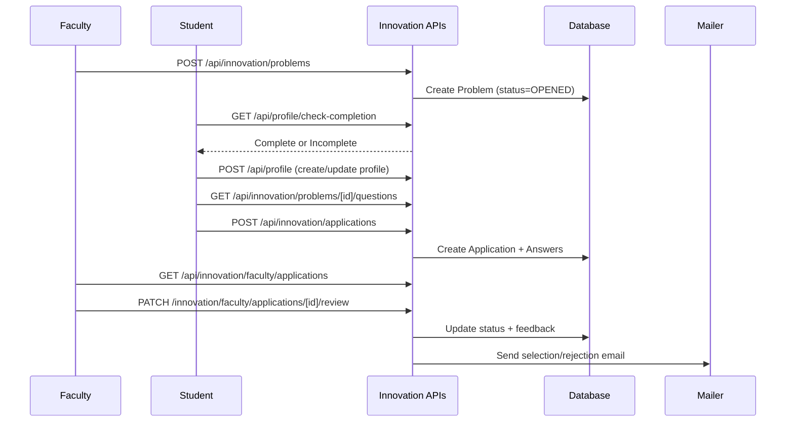
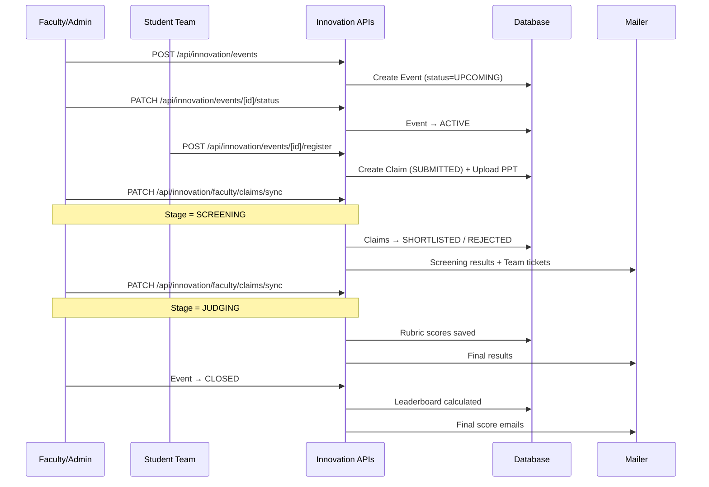
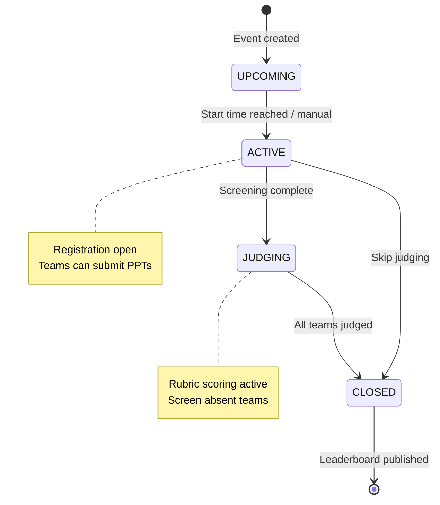
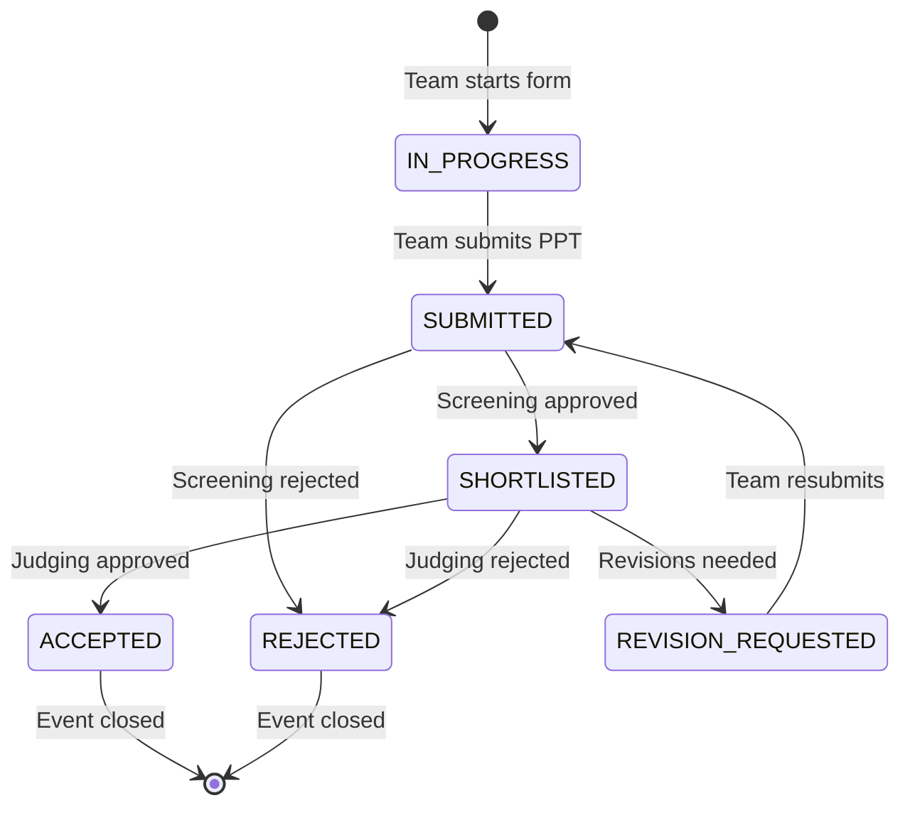

# Innovation Platform

## Overview

The Innovation Platform is the largest and most complex module in the CoE Portal. It manages two distinct tracks:

1. **Open Problems** — Faculty create problem statements; students submit applications with profiles and custom answers
2. **Hackathons** — Faculty create events with timelines; student teams register, submit PPTs, get screened, judged, and scored

## Why This Module Exists

The Centre of Excellence runs innovation programs to encourage students to solve real-world problems. This platform digitizes the entire workflow:

- **Before**: Students emailed applications, faculty manually tracked them, hackathon judging was paper-based
- **After**: Structured submissions, rubric-based scoring, automated emails, leaderboards

## Real-World Analogy

**Open Problems** is like a job application portal:
- **Company** = Faculty (creates the job posting / problem)
- **Job posting** = Problem statement
- **Resume** = Student profile
- **Cover letter answers** = Problem-specific questions
- **HR** = Faculty reviewing applications

**Hackathons** is like a sports tournament:
- **Tournament organizer** = Faculty (creates the event)
- **Teams** = Student teams that register
- **Group stage** = PPT screening
- **Finals** = Final judging with rubric scores
- **Trophy** = Leaderboard position

## Architecture

```mermaid
graph TB
    subgraph "Open Problems Track"
        FP[Faculty creates Problem]
        SP[Student creates Profile]
        SQ[Student answers Questions]
        SA[Student submits Application]
        FR[Faculty reviews Application]
    end

    subgraph "Hackathon Track"
        FE[Faculty creates Event]
        TR[Team registers + Uploads PPT]
        SC[Screening: SHORTLISTED / REJECTED]
        JG[Judging: Rubric Scores]
        LB[Leaderboard published]
    end

    subgraph "Shared Components"
        AUTH["authenticate() + authorize()"]
        MAIL["Email Notifications"]
        STORE["File Uploads (MinIO)"]
        SCORE["Scoring Engine"]
        TICKET["Ticket Generation"]
    end

    FP --> AUTH
    SP --> AUTH
    SA --> AUTH
    SA --> MAIL
    FR --> MAIL
    FE --> AUTH
    TR --> STORE
    SC --> MAIL
    JG --> SCORE
    SC --> TICKET

    subgraph "Database"
        PROBLEM[(problems)]
        PROFILE[(student_profiles)]
        APP[(applications)]
        CLAIM[(claims)]
        EVENT[(hackathon_events)]
    end

    FP --> PROBLEM
    SP --> PROFILE
    SA --> APP
    FR --> APP
    TR --> CLAIM
    SC --> CLAIM
    JG --> CLAIM
    FE --> EVENT
    LB --> CLAIM
```



## Open Problems Workflow



### Key Models

```prisma
model Problem {
  id          Int
  title       String
  description String
  mode        ProblemMode    // OPEN or CLOSED
  status      ProblemStatus  // OPENED, CLOSED, ARCHIVED
  problemType ProblemType    // OPEN, INTERNSHIP, FACULTY_INTERNSHIP
  createdById Int
  createdBy   User
  questions   ProblemQuestion[]
  applications Application[]
  claims      Claim[]
}

model StudentProfile {
  id         Int
  userId     Int      @unique
  user       User
  skills     String?
  experience String?
  interests  String?
  resumeUrl  String?
  isComplete Boolean  @default(false)
  applications Application[]
}

model Application {
  id        Int
  userId    Int
  user      User
  profileId Int?
  profile   StudentProfile?
  problemId Int
  problem   Problem
  status    ApplicationStatus  // SUBMITTED, SELECTED, REJECTED
  answers   ApplicationAnswer[]
  feedback  String?
}

model ApplicationAnswer {
  id            Int
  applicationId Int
  questionId    Int
  question      ProblemQuestion
  answerText    String
}

model ProblemQuestion {
  id          Int
  problemId   Int
  questionText String
  type        String @default("TEXT")
  answers     ApplicationAnswer[]
}
```

## Hackathon Workflow



### Key Models

```prisma
model HackathonEvent {
  id          Int
  title       String
  description String?
  startTime   DateTime
  endTime     DateTime
  status      EventStatus  // UPCOMING, ACTIVE, JUDGING, CLOSED
  registrationOpen Boolean @default(true)
  createdById Int
  createdBy   User
  problems    Problem[]
}

model Claim {
  id                Int
  problemId         Int
  problem           Problem
  teamName          String?
  members           ClaimMember[]
  status            ClaimStatus  // IN_PROGRESS, SUBMITTED, SHORTLISTED, ACCEPTED, REJECTED, REVISION_REQUESTED
  submissionUrl     String?
  submissionFileKey String?
  // Rubric scores
  innovationScore   Int?
  technicalScore    Int?
  impactScore       Int?
  uxScore           Int?
  executionScore    Int?
  presentationScore Int?
  feasibilityScore  Int?
  finalScore        Int?
  score             Int?
  feedback          String?
  isAbsent          Boolean @default(false)
  tickets           Ticket[]
}

model ClaimMember {
  id      Int
  claimId Int
  userId  Int
  user    User
  role    String @default("MEMBER")
}
```

## Scoring Engine

**File: `src/lib/hackathon-scoring.ts`**

```typescript
export const HACKATHON_RUBRIC_WEIGHTS = {
  innovation: 15,
  technical: 20,
  impact: 15,
  ux: 10,
  execution: 20,
  presentation: 10,
  feasibility: 10,
};

export const calculateWeightedHackathonScore = (scores: HackathonRubricScores): number => {
  return Math.round(
    scores.innovation + scores.technical + scores.impact +
    scores.ux + scores.execution + scores.presentation + scores.feasibility
  );
};
// Maximum possible: 100 points
```

## Event Status State Machine



## Claim Status State Machine



## API Endpoints

| Endpoint | Method | Purpose | Auth |
|----------|--------|---------|------|
| `/api/innovation/problems` | GET | List problems | Public/Student |
| `/api/innovation/problems` | POST | Create problem | Faculty/Admin |
| `/api/innovation/problems/[id]` | PATCH | Update problem | Faculty/Admin |
| `/api/innovation/problems/[id]/questions` | GET | Get questions | Authenticated |
| `/api/innovation/applications` | POST | Submit application | Student |
| `/api/innovation/applications/my` | GET | My applications | Student |
| `/api/innovation/events` | GET | List events | Public |
| `/api/innovation/events` | POST | Create event | Faculty/Admin |
| `/api/innovation/events/[id]/register` | POST | Register team | Student |
| `/api/innovation/events/[id]/leaderboard` | GET | Get leaderboard | Public (CLOSED only) |
| `/api/innovation/faculty/applications` | GET | List applications | Faculty/Admin |
| `/api/innovation/faculty/applications/[id]/review` | PATCH | Review application | Faculty/Admin |
| `/api/innovation/faculty/claims/sync` | PATCH | Screening/Judging sync | Faculty/Admin |
| `/api/innovation/admin/events/[id]/status` | PATCH | Change event status | Admin |

## Common Bugs

### 1. Profile Not Complete Error

**Problem**: Student tries to apply but gets "Complete your profile first". The check happens on the frontend before showing the apply button, but the API also checks server-side.

**Fix**: Create/update profile at `POST /api/profile` before applying.

### 2. Leaderboard Not Visible

**Problem**: Leaderboard endpoint returns empty or 404. The leaderboard is only available when event status is `CLOSED`.

**Fix**: Ensure the event status has been changed to `CLOSED` in the admin panel.

### 3. Judging Sync Fails

**Problem**: During JUDGING sync, rubric scores are required. If any rubric field is missing, the entire sync fails with validation error.

**Fix**: Ensure ALL rubric fields (innovation, technical, impact, ux, execution, presentation, feasibility) are provided. Absent teams (isAbsent=true) are skipped.

## Exercises

1. **Add a new rubric criterion**: Add field to Claim model, add to HACKATHON_RUBRIC_WEIGHTS
2. **Create a new problem type**: Extend ProblemType enum
3. **Add auto-scoring**: Calculate finalScore automatically based on rubric weights
4. **Add team size validation**: Modify the registration endpoint

## Summary

The Innovation Platform is the most feature-rich module with two tracks (open problems and hackathons), complex state machines, rubric-based scoring, ticket generation, and multi-stage email notifications. It demonstrates advanced Prisma queries, file uploads, state validation, and transactional operations.
