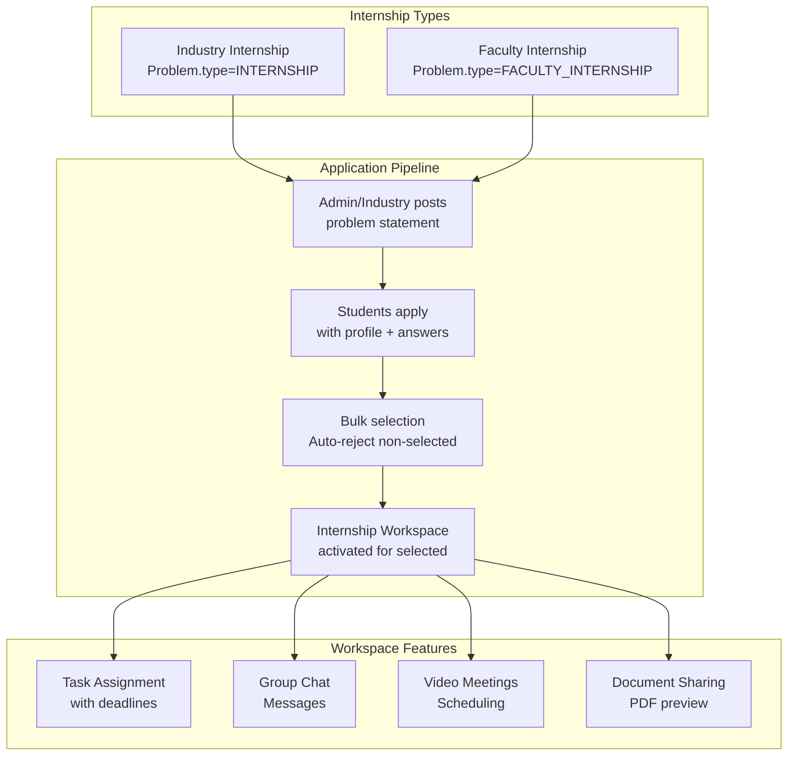

# Internship System

## Overview

The Internship System manages three types of internships:

1. **Industry Internships** — External companies offer internships; students apply
2. **Faculty Internships** — Faculty members offer research/teaching internships
3. **Internship Workspaces** — Collaboration spaces for selected interns (tasks, messages, meetings, documents)

## Why This Module Exists

The CoE connects students with industry and faculty internship opportunities. This system digitizes the entire workflow: posting opportunities, collecting applications, selecting candidates, and providing collaboration workspaces.

## Architecture



## Data Model

Internships are modeled as `Problem` records with `problemType`:

```typescript
// prisma/schema.prisma
enum ProblemType {
  OPEN                // Regular innovation problem
  INTERNSHIP          // Industry internship
  FACULTY_INTERNSHIP  // Faculty internship
}
```

### Workspace Models

```prisma
model InternshipTask {
  id           Int
  problemId    Int               // Links to the internship Problem
  title        String
  description  String?
  assignedToId Int               // User
  deadline     DateTime?
  status       InternshipTaskStatus  // PENDING, IN_PROGRESS, COMPLETED
}

model InternshipMessage {
  id        Int
  problemId Int
  senderId  Int
  content   String
  createdAt DateTime
}

model InternshipMeeting {
  id           Int
  problemId    Int
  title        String
  datetime     DateTime
  link         String
  description  String?
  isActive     Boolean @default(true)
}

model InternshipDocument {
  id           Int
  problemId    Int
  fileUrl      String?
  linkUrl      String?
  title        String?
  documentType InternshipDocumentType  // FILE or LINK
  uploadedById Int
}
```

## API Endpoints

| Endpoint | Purpose |
|----------|---------|
| `/api/internships/add-participant` | Add participant to internship |
| `/api/tasks` | Task CRUD |
| `/api/messages` | Message CRUD |
| `/api/meetings` | Meeting CRUD |
| `/api/documents` | Document CRUD |

## Selection Flow

```
1. Admin or Industry creates problem with problemType=INTERNSHIP
2. Students apply via innovation application system
3. Admin/Industry reviews applications
4. Bulk selection endpoint marks SELECTED/REJECTED
5. Non-selected applicants get auto-rejection
6. Selected participants gain workspace access
7. Workspace features (tasks, chat, meetings, documents) become available
```

## Common Bugs

### 1. Missing Industry Name

**Problem**: Creating an INTERNSHIP problem requires `isIndustryProblem: true` and `industryName` to be set.

**Fix**: Zod validation enforces this: `innovationProblemCreateSchema` checks that if `isIndustryProblem`, then `industryName` is required.

### 2. Workspace Not Visible

**Problem**: Selected student can't see internship workspace.

**Fix**: Check that the student's Application status is `SELECTED` for the internship problem. Workspace access is determined by application status.

## Exercises

1. **Add a workspace feature**: Polls, announcements, shared calendar
2. **Add file upload to messages**: Allow image/file attachments in chat
3. **Add deadline notifications**: Email/task reminders for approaching deadlines

## Summary

The Internship System extends the innovation platform to support industry and faculty internships with dedicated collaboration workspaces including task management, chat, meetings, and document sharing.
