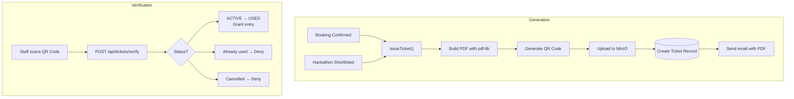

# Ticket System

## Overview

The Ticket System generates PDF tickets with QR codes for confirmed facility bookings and hackathon selection. Tickets are stored in MinIO and delivered via email.

## Why This Module Exists

Physical events need proof of booking/selection:
- **Facility booking**: Student shows the ticket at the lab entrance
- **Hackathon**: Shortlisted teams get tickets for final judging

QR codes allow quick verification at entry.

## How Tickets Work



## Ticket ID Format

```typescript
// Facility booking tickets
const ticketId = `BKG-${datePart}-${randomHex}`;
// Example: BKG-20260727-a1b2c3d4e5f6a7b8c9d0

// Hackathon selection tickets
const ticketId = `HKT-${datePart}-${randomHex}`;
// Example: HKT-20260727-f1e2d3c4b5a69788796a5
```

## PDF Generation

**File: `src/lib/tickets.ts`** (863 lines)

Uses `pdf-lib` for PDF generation and `qrcode` for QR codes:

```typescript
const pdfDoc = await PDFDocument.create();
const page = pdfDoc.addPage([595.28, 841.89]);  // A4

// Dark blue header
page.drawRectangle({ x: 0, y: 770, width: 595, height: 70, color: rgb(0, 0.13, 0.33) });

// "DIGITAL TICKET" label
page.drawText("DIGITAL TICKET", { x: 50, y: 740, size: 14, color: rgb(0.97, 0.58, 0.11) });

// QR Code
const qrDataUrl = await QRCode.toDataURL(verificationUrl, { width: 240, margin: 2 });
const qrImage = await pdfDoc.embedPng(qrDataUrl);
page.drawImage(qrImage, { x: 50, y: 250, width: 120, height: 120 });
```

## Verification

```typescript
// POST /api/tickets/verify
// Body: { ticketId, session?, memberIds? }

// For facility bookings:
await verifyAndConsumeTicket(ticketId, verifiedByUserId);
// Status: ACTIVE → USED

// For hackathon:
const info = await verifyTicketForCheckIn(ticketId, session);
await markHackathonTeamMembersPresent(ticketId, memberIds, userId, session);
```

## Database Models

### Ticket

```prisma
model Ticket {
  id            Int          @id @default(autoincrement())
  ticketId      String       @unique
  type          TicketType   // FACILITY_BOOKING or HACKATHON_SELECTION
  status        TicketStatus // ACTIVE, USED, CANCELLED
  userId        Int
  bookingId     Int?         @unique  // One ticket per booking
  claimId       Int?
  title         String
  subjectName   String
  pdfObjectKey  String       // MinIO path
  qrValue       String       // Verification URL
  scheduledAt   DateTime?
  issuedAt      DateTime     @default(now())
  usedAt        DateTime?
  cancelledAt   DateTime?
}
```

### TicketAttendance (Hackathon only)

```prisma
model TicketAttendance {
  ticketId   Int
  userId     Int
  session    Int
  status     MemberAttendanceStatus  // NOT_PRESENT, PRESENT
  checkedInAt DateTime?
  checkedInBy User?
}
```

## Key Files

| File | Purpose |
|------|---------|
| `src/lib/tickets.ts` | Ticket generation, PDF, QR, verification logic |
| `src/app/api/tickets/verify/route.ts` | Verify + consume ticket |
| `src/app/api/tickets/my/route.ts` | List user's tickets |
| `src/app/api/tickets/[ticketId]/download/route.ts` | Download PDF |
| `src/app/api/tickets/[ticketId]/cancel/route.ts` | Cancel ticket |

## Common Bugs

### 1. PDF Generation Fails for Large Data

**Problem**: Too many team members cause the PDF to exceed memory limits.

**Fix**: The hackathon ticket shows team members in a table. If there are many members, the PDF layout may need adjustment.

### 2. QR Code URL Expired

**Problem**: The QR code points to a URL that changes (e.g., after deployment).

**Fix**: The QR value is stored in the database at ticket creation time. It should use a stable URL format.

### 3. Duplicate Tickets

**Problem**: Double-click on confirm creates two tickets for the same booking.

**Fix**: The `bookingId` field has `@unique` constraint, preventing duplicate tickets. The `issueTicket()` function checks for existing tickets before creating a new one.

## Exercises

1. **Change ticket design**: Modify colors, fonts, layout in `src/lib/tickets.ts`
2. **Add barcode**: Add a Code128 barcode alongside the QR code
3. **Add ticket expiry**: Auto-cancel tickets after the event date passes

## Summary

The Ticket System generates professionally formatted PDF tickets with QR codes for facility bookings and hackathon events. It uses pdf-lib for PDF generation, QRCode for QR codes, and MinIO for persistent storage. Tickets are emailed as attachments and verified at entry points.
